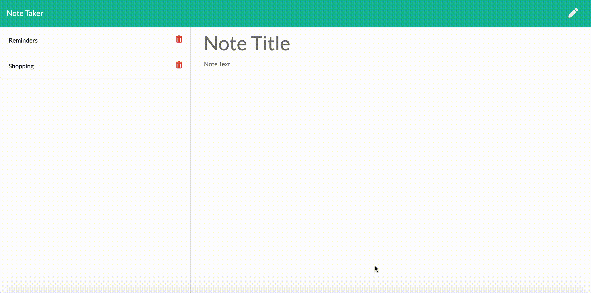
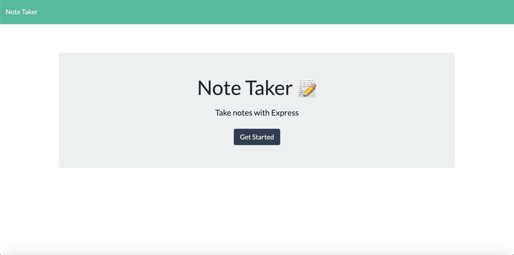
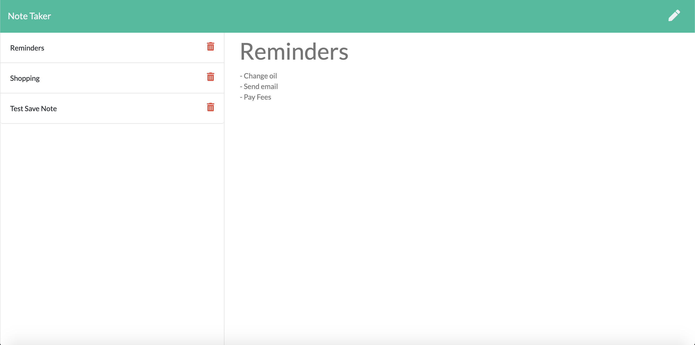

# Note-Worthy
Manage your own NOTES !!! 

An application that can be used to write, save, and delete notes. This application will use an express backend and save and retrieve note data from a JSON file.

> AS A USER, I want to be able to write and save notes
>
> I WANT to be able to delete notes I've written before
>
> SO THAT I can organize my thoughts and keep track of tasks I need to complete

## Deployment 

The application has been deployed on heroku. Click below to go to the link : 

[Heroku App URL](https://note-worty.herokuapp.com/)

## Repository 

Click the link below to check the repository :

[GitHub URL](https://github.com/ianasqazi/Note-Worthy)

## Preview



## Requirements

For testing, you will need Node.js and node global package, and also the following dependency packages installed in your environment.  

### Node

 Just go on [official Node.js website](https://nodejs.org/) and download the installer.

Also, be sure to have `git` available in your PATH, `npm` might need it (You can find git [here](https://git-scm.com/)).  

To check if its already installed just type the following commands to verify :

```bash
node --version
v12.6.0

git --version
git version 2.21.0 (Apple Git-122)

npm --version
6.13.1
```

### NPM Packages

- Express // Framework for the app 
- Shortid // create random ID for each note saved 
- Nodemon // Dev - Dependency 

## Running the Application

Run the following commands in your terminal window 

```bash
git clone https://github.com/ianasqazi/Note-Worthy.git

cd Note-Worthy

npm install
```

All packages will be installed and now run the application with the command below : 

```bash
npm start
```


## Screenshots



